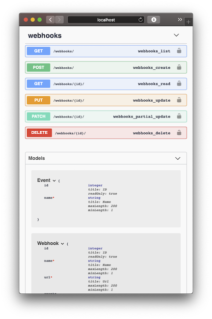
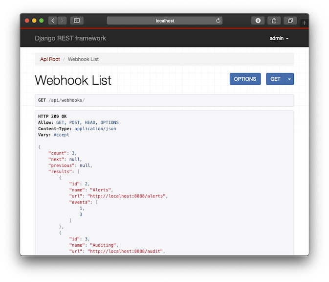
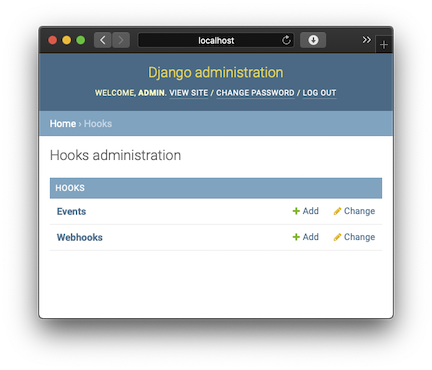

# Hooks

> What's New : Added [REST API](docs/api.md) and added [tests with code coverage](docs/tests.md)


A simple [webhooks](https://en.wikipedia.org/wiki/Webhook) manager with event  triggering.

Provides a web application interface and a REST API interface.

A simple event triggering endpoint and a consumer app are provided for testing.


Built using [Django](https://www.djangoproject.com) web framework and [Huey](https://huey.readthedocs.io/en/latest/)
task queue.

## Quick Start

- [Deploy using Docker](docs/docker.md)
- [Run using Python venv](docs/python-venv.md)
- [REST API](docs/api.md)
- [Admin Page](#admin-interface)

> Additional [developer setup notes](docs/developer-notes.md)

## High level requirements

A Django webhooks application that:
 - Re-queues the webhooks if the server doesn't respond with a 2xx code.
 - Exposes a clean interface for registering and using the webhooks.

## Functional design

### Server application

This Django server application triggers a set of events which executes registered webhooks for each event.
The webhhok POST request execution will be submitted to a task queue which will do non-blocking execution with
retries on failure.

The application allows registering of one or more webhook url's with one or more of these events.

> This is similar to the github woobhooks registration for github events/actions.

### Client application for testing

This is a demo client application that can receive/consume a set of webhooks used for testing the server app.

> Any of the public webhooks test sites like [webhook.site](https://webhook.site) can also be used but having a local
>consumer allows us to test failure cases and retry easily.

Consumer logs the request path and request body of the webhook POST request and responds with 200 OK and empty body.

```shell script
$ python consumer/consumer.py
Starting webhook consumer at http://127.0.0.1:8888/
Received POST /alerts event=delete&time=2020-04-13T21%3A30%3A28.152727, Responded with 200
...
```

You can also run the consumer to return Non-OK response code to test retry queueing.

```shell script
$ python consumer/consumer.py 500
Starting webhook consumer at http://127.0.0.1:8888/
Received POST /logging event=delete&time=2020-04-13T21%3A38%3A24.155220, Responded with 500
...
```

## Server application design

### Webhook registration

Webhooks are created and linked to one or more of the event/s.

### Event triggering

Events are triggered using a trigger API endpoint `trigger/<event>`

Can be triggered from the Web application browser or from command line.

```shell script
$ curl http://localhost:8000/trigger/create
...
Triggered event "create" ...
...
```

### Webhook execution

For each event trigger:
 - Lookup the webhooks for the corresponding event from database
 - Submit a POST request for each webhook with event details as the payload using a retrying task queue
 - Any non-success response code or any exceptions will make the webhook and payload to be retried by the task queue

> Task queue retry delay is configurable in `server/server/settings.py` as `HOOKS_RETRY_DELAY_SECS = 3`

### Webhook task queue

Decided to use [Huey](https://huey.readthedocs.io/en/latest/) task queue which is a lightweight alternative to more
feature rich and popular task queues like Celery/RQ/Carrot.

- Can work with the built-in SQLite as the backend for demo/prototype
- Can switch to Redis as the backend easily for production
- Other task queues requires Redis or RabbitMQ even for prototype
- Has Django framework integration

## Server application data layer

The server application will use the built-in [SQLite](https://www.sqlite.org/index.html) database with data access
implemented through ORM layer using data [models](https://docs.djangoproject.com/en/3.0/topics/db/models/) and
[QuerySets](https://docs.djangoproject.com/en/3.0/ref/models/querysets/#django.db.models.query.QuerySet).

## Server application deployment

Dockerized as a simple [single image](docker.md)

## REST API

[REST API documentation](docs/api.md)


| `http://localhost:8000/api-help/` | `http://localhost:8000/api/` |
| --- | --- |
|  |   |


## Tests and code coverage

[Run tests with coverage reporting](docs/tests.md)

## Admin interface

Available at `http://localhost:8000/admin/`



> When [deploying using Docker](docs/docker.md) default admin credentials are admin/admin

## TODO

- Dev
  - Code quality - unit tests, docstrings, type hints, pylint etc.
  - Add a common base template for all page templates
  - Enable HTTPS for the server and for webhook consumer target URLs
  - Enable user authentication for API and webapp
- Deploy (Changes for production deployment)
  - Docker compose with separate images and shared volume for database
  - Switch out SQLite with PostgreSQL/MySQL
  - Use Redis backend for Huey or switch to advanced task queue like Celery
    - Celery can provide dead-letter delivery, back-off retries etc.
  - Deploy with uWSGI and NGINX
