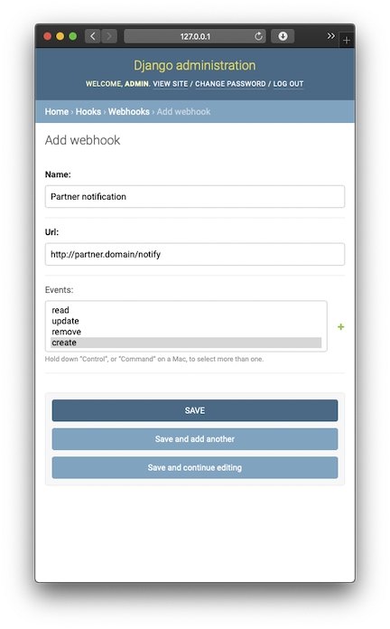

# Django Hook

A simple [webhooks](https://en.wikipedia.org/wiki/Webhook) demo application using
[Django](https://www.djangoproject.com) deployed using
[uWSGI caching](https://uwsgi-docs.readthedocs.io/en/latest/Caching.html) for
[QuerySets](https://docs.djangoproject.com/en/3.0/ref/models/querysets/) 

> See current [project status](docs/status.md) :clipboard: 
>
- [High Level Requirements](#high-level-requirements)
- [Functional Design](#functional-design)
- [Application Design](#server-application-design)
- [Data layer](#server-application-data-layer)
- [Deployment](#server-application-deployment)
- [Project Status](docs/status.md)
- [Developer Notes](docs/developer-notes.md)

## High level requirements

A Django webhooks application that:
 - Re-queues the webhooks if the server doesn't respond with a 2xx code.
 - Exposes a clean interface for registering and using the webhooks.
 - Uses uWSGI caching to cache QuerySets

## Functional design

### Server application

This demo server application triggers a set of pre-defined events. These events can be triggered on demand and/or
randomly triggered periodically in the main application loop.

The demo application allows registering of one or more webhook url's with one or more of these pre-defined events.

> This is similar to the github woobhooks registration for github events/actions.

> Initially use the Django provided admin interface to create events and registering webhhooks.

### Client application for testing

This is a demo client application that can receive/consume a set of webhooks used for testing the server app.
This client will have webhok endpoint than can respond with custom response code range to test the re-queuing
on server app.

> Any of the public webhooks test sites like [webhook.site](https://webhook.site) can also be used for normal testing
> without the re-queuing scenario.

> Client app tests could be replaced/replicated using
>[unittest.mock](https://docs.python.org/3/library/unittest.mock.html)

## Server application design

### Webhook registration

Using the Django admin to do the event and webhook creation and registration during the testing.

[See more screenshots](docs/status.md#april-2-2020)

### Event triggering

Events are triggered using a trigger API endpoint `trigger/<event>`

### Webhook execution

For each event trigger:
 - Lookup the webhooks for the corresponding event from database
 - Execute POST on each with event name as the payload.
 - For non-Success response or failed connection add the webhook and payload to retry queue

### Webhook retry loop

This will be a separate scheduled task execution thread that will retry the queued up failed webhooks.

> Could be simple database backed queue with task scheduler like [scheduler](https://github.com/dbader/schedule)
> or could be a full blown task queue like Celery/RQ/Huey/Carrot etc.

## Server application data layer

The server application will use the built-in [SQLite](https://www.sqlite.org/index.html) database with data access
implemented through ORM layer using data [models](https://docs.djangoproject.com/en/3.0/topics/db/models/) and
[QuerySets](https://docs.djangoproject.com/en/3.0/ref/models/querysets/#django.db.models.query.QuerySet).

## Server application deployment

The server application will be configured to be deployed using
[uWSGI](https://uwsgi-docs.readthedocs.io/en/latest/WSGIquickstart.html) and [NGINX](https://www.nginx.com)
With uWSGI configured to enable caching.
The application with the uWSGI and NGINX servers will be packaged as a Docker image with all dependencies for quick
deployment.

