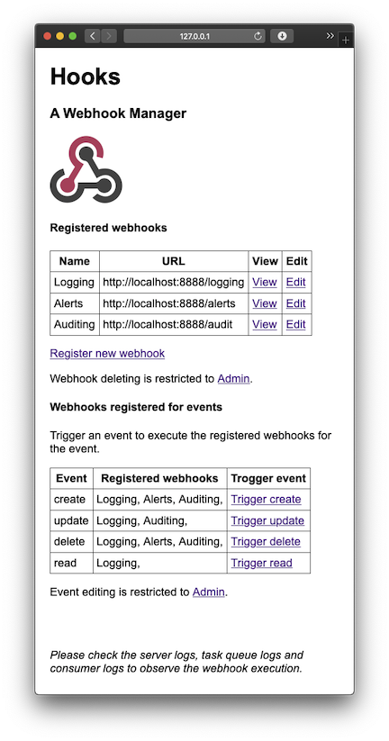

# Django Hook

A simple [webhooks](https://en.wikipedia.org/wiki/Webhook) manager with event  triggering.

Built using [Django](https://www.djangoproject.com) web framework and [Huey](https://huey.readthedocs.io/en/latest/)
task queue.

> See current [project status](docs/status.md) :clipboard: 
>
- [Quick Start](#quick-start)
- [High Level Requirements](#high-level-requirements)
- [Functional Design](#functional-design)
- [Application Design](#server-application-design)
- [Data layer](#server-application-data-layer)
- [Deployment](#server-application-deployment)
- [Project Status](docs/status.md)
- [TODO](#todo)
- [Developer Notes](docs/developer-notes.md)

## Quick Start

> See [latest status](docs/status.md) for updates

Setup Python

```
$ python --version
Python 3.7.7
```

```
$ python -m venv venv
$ source venv/bin/activate
```

Install modules

```
$ pip install -r requirements.txt
```

Initialize database

```
$ cd server
$ python manage.py migrate
```

Create admin user

```
$ python manage.py createsuperuser
```

Run task queue workers

```
$ python manage.py run_huey
```

Start Django webhook server on 8000

```
$ python manage.py runserver
Starting development server at http://127.0.0.1:8000/
```

Open [http://127.0.0.1:8000](http://127.0.0.1:8000) on browser



Add events using app admin [http://127.0.0.1:8000/admin](http://127.0.0.1:8000/admin) interface so we can test webhhoks.

Register webhooks from main app page [http://127.0.0.1:8000](http://127.0.0.1:8000) to test, using URLs pointing to test
server and link to events.

Example URL: `http://127.0.0.1:8888/test/one`

Start a test webhook consumer on port 8888 and trigger events from main app page
[http://127.0.0.1:8000](http://127.0.0.1:8000)

```
$ cd consumer
$ python consumer.py
Starting webhook consumer on http://127.0.0.1:8888/
```

## High level requirements

A Django webhooks application that:
 - Re-queues the webhooks if the server doesn't respond with a 2xx code.
 - Exposes a clean interface for registering and using the webhooks.
 - Uses uWSGI caching to cache QuerySets

## Functional design

### Server application

This demo server application triggers a set of pre-defined events. These events can be triggered on demand and/or
randomly triggered periodically in the main application loop. The webhhok POST request execution will be submitted
to a task queue which will do non-blocking execution with retries on failure.

The demo application allows registering of one or more webhook url's with one or more of these pre-defined events.

> This is similar to the github woobhooks registration for github events/actions.

> Initially use the Django provided admin interface to create events and for creating and registering webhhooks.

### Client application for testing

This is a demo client application that can receive/consume a set of webhooks used for testing the server app.

> Any of the public webhooks test sites like [webhook.site](https://webhook.site) can also be used for normal testing
> without the re-queuing scenario.

> Client app tests could be replaced/replicated using
>[unittest.mock](https://docs.python.org/3/library/unittest.mock.html)

## Server application design

### Webhook registration

Webhooks are created and linked one or more of the event/s.

### Event triggering

Events are triggered using a trigger API endpoint `trigger/<event>`

### Webhook execution

For each event trigger:
 - Lookup the webhooks for the corresponding event from database
 - Submit a POST request for each webhook with event name as the payload using a retrying task queue
 - For non-Success response or failed connection add the webhook and payload to retry queue

### Webhook task queue

Decided to use [Huey](https://huey.readthedocs.io/en/latest/) task queue which is a lightweight alternative to more
feature rich and popular task queues like Celery/RQ/Carrot.

- Can work with the built-in SQLite as the backend for demo/prototype
- Can switch to Redis as the backend easily for production
- Other task queues requires Redis or RabbitMQ even for prototype
- Has Django framework integration

## Server application data layer

The server application will use the built-in [SQLite](https://www.sqlite.org/index.html) database with data access
implemented through ORM layer using data [models](https://docs.djangoproject.com/en/3.0/topics/db/models/) and
[QuerySets](https://docs.djangoproject.com/en/3.0/ref/models/querysets/#django.db.models.query.QuerySet).

## Server application deployment

> This is a stretch goal to integrate uWSGI and NGINX

The server application will be configured to be deployed using
[uWSGI](https://uwsgi-docs.readthedocs.io/en/latest/WSGIquickstart.html) and [NGINX](https://www.nginx.com)
With uWSGI configured to enable caching.
The application with the uWSGI and NGINX servers will be packaged as a Docker image with all dependencies for quick
deployment.

## TODO

- Dockerizing the deployment
- Add a fixture for initializing db with few test events and webhooks
- Code quality - unit tests, docstrings, pylint etc.
- Update test consumer to test non 2xx response code easily
- Add a CSS file for better formatting of the web interface pages
- Add a REST API interface for webhoock registration (stretch goal)

