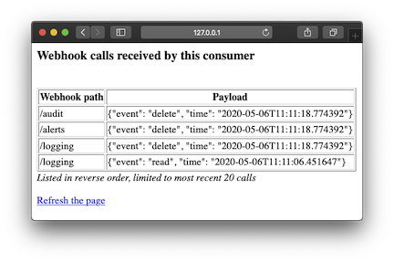

# Python venv

Set up Python

```
$ python --version
Python 3.7.7
```

```
$ python -m venv venv
$ source venv/bin/activate
```

Install modules

```
$ pip install -r requirements.txt
```

Get the source

```
$ git clone git@github.com:hackorama/django-hook.git
$ cd django-hook
```

Initialize database

```
$ cd server
$ python manage.py migrate
```

Create admin user

```
$ python manage.py createsuperuser
```

Load sample test data 

```
$ python manage.py loaddata sample-data
```

Run task queue workers

```
$ python manage.py run_huey
```

Start Django webhook server on 8000

```
$ python manage.py runserver
Starting development server at http://127.0.0.1:8000/
```

Start test consumer on port 8888

```
$ cd consumer
$ python consumer.py
Starting webhook consumer on http://127.0.0.1:8888/
```

Open [http://127.0.0.1:8000](http://127.0.0.1:8000) on browser to access the server.

See [the tests page](tests.md) on how to use test consumer and test the webhook execution.


Open [http://127.0.0.1:8888](http://127.0.0.1:8888) on browser to access the test consumer.




> Additional [developer setup notes](docs/developer-notes.md)
