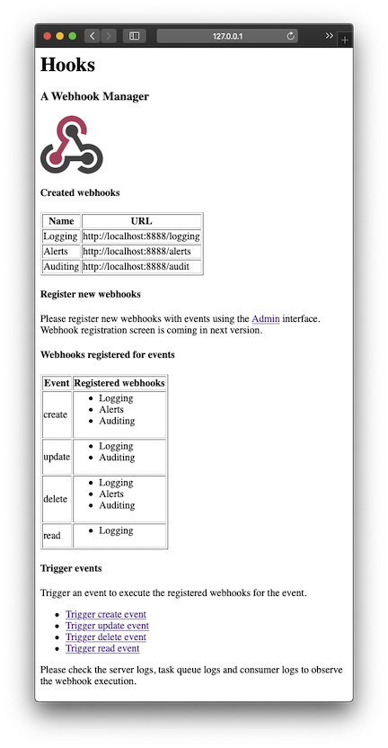
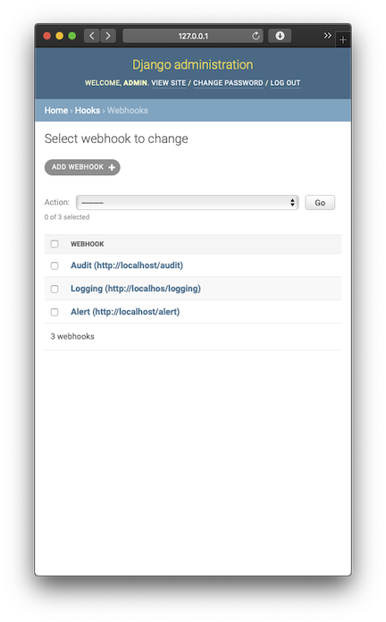
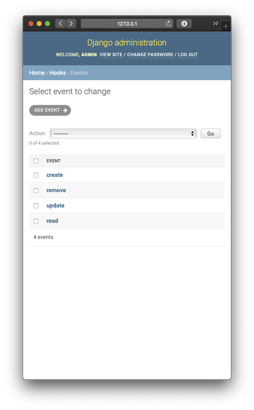
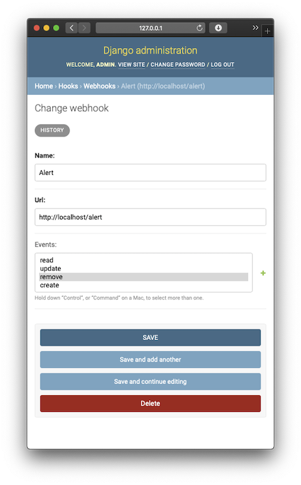

# Status

- [April 4 2020](#april-4-2020)
- [April 3 2020](#april-3-2020)
- [April 2 2020](#april-2-2020)
- [April 1 2020](#april-1-2020)

## April 4 2020

- Added a task queue for non-blocking webhook POST request execution with retries (see below for details)
- Added a Django template index page listing webhooks, events and trigger links
- Updated design and added notes on Huey as the light weight task queue choice in [README](../README.md)



**Test task queue execution - set up server, queue workers and consumer**

```
$  python manage.py runserver
Starting development server at http://127.0.0.1:8000/
```

```
$ python manage.py run_huey
[2020-04-04 14:58:31,204] INFO:huey.consumer:MainThread:Huey consumer started with 4 thread, PID 60862 at 2020-04-04 21:58:31.204599
+ hooks.views.post_url
```

```
$ python consumer.py
Starting webhook consumer on http://127.0.0.1:8888
```

**Trigger an event**

```
$ curl http://127.0.0.1:8000/trigger/create
Triggering event create ...
$
```

**Verify task execution through task queue**

```
$ python manage.py run_huey
...
[2020-04-04 15:06:07,930] INFO:huey:Worker-1:Executing hooks.views.post_url: 0734bcdd-7ba1-4399-b21f-b3d4c432bfe1
Making POST request at http://localhost:8888/logging with body {'event': 'create'}
[2020-04-04 15:06:07,968] INFO:huey:Worker-1:hooks.views.post_url: 0734bcdd-7ba1-4399-b21f-b3d4c432bfe1 executed in 0.038s
...
```

**Kill the consumer and trigger another event**

```
$ curl http://127.0.0.1:8000/trigger/delete
Triggering event delete ...
$
```

**Verify task execution retries**

```
$ python manage.py run_huey
...
Making POST request at http://localhost:8888/alerts with body {'event': 'delete'}
ERROR: Failed POST request at http://localhost:8888/alerts
[2020-04-04 15:08:50,361] INFO:huey:Worker-4:Task 2bd11757-b450-4930-b7cd-90d4bf733ac4 raised RetryTask, retrying.
Making POST request at http://localhost:8888/audit with body {'event': 'delete'}
...
```

**Run the consumer again and verify the task queue retry succeeds**

```
$ python manage.py run_huey
...
[2020-04-04 15:09:53,906] INFO:huey:Worker-3:Executing hooks.views.post_url: 2bd11757-b450-4930-b7cd-90d4bf733ac4 @2020-04-04 22:08:57.463110
Making POST request at http://localhost:8888/alerts with body {'event': 'delete'}
[2020-04-04 15:09:53,934] INFO:huey:Worker-3:hooks.views.post_url: 2bd11757-b450-4930-b7cd-90d4bf733ac4 @2020-04-04 22:08:57.463110 executed in 0.028s
...
```

## April 3 2020

- Added a simple webhook consumer HTTP serer for testing
- Added event trigger endpoint on the Django app for testing
- Implemented webhook execution for event triggers
- Stubbed out enqueueing of non-success response for the webhook calls

**Run the server and test consumer**

```
$  python manage.py runserver
Starting development server at http://127.0.0.1:8000/
...
```

```
$ python consumer.py
Starting webhook consumer on http://127.0.0.1:8888
...
```

**Trigger an event**

```
$ curl http://127.0.0.1:8000/trigger/create
Triggering event create ...
$
```

**Confirm registered webhooks are executed for the event**

Server finds the registered webhooks for the event and executes them

```
...
Starting development server at http://127.0.0.1:8000/
...
Submitting webhook Logging for event create ...
Making POST request at http://localhost:8888/logging with body {'event': 'create'}
Submitting webhook Alerts for event create ...
Making POST request at http://localhost:8888/alerts with body {'event': 'create'}
Submitting webhook Auditing for event create ...
Making POST request at http://localhost:8888/audit with body {'event': 'create'}
```

**Confirm the webhook calls are received on consumer side**

```
...
Starting webhook consumer on http://127.0.0.1:8888 ...
...
Received POST /audit event=create
Received POST /alerts event=create
Received POST /logging event=create
```

**Kill the consumer and trigger another event**

```
$ curl http://127.0.0.1:8000/trigger/delete
Triggering event delete ...
$
```

Verify the sever is adding the failed webhooks to retry queue

```
Submitting webhook Logging for event delete ...
Making POST request at http://localhost:8888/logging with body {'event': 'delete'}
Submitting webhook Alerts for event delete ...
Making POST request at http://localhost:8888/alerts with body {'event': 'delete'}
Submitting webhook Auditing for event delete ...
Making POST request at http://localhost:8888/audit with body {'event': 'delete'}
ERROR: Failed POST request at http://localhost:8888/logging
TODO: Add to retry queue url = http://localhost:8888/logging, event = delete
ERROR: Failed POST request at http://localhost:8888/alerts
TODO: Add to retry queue url = http://localhost:8888/alerts, event = delete
ERROR: Failed POST request at http://localhost:8888/audit
TODO: Add to retry queue url = http://localhost:8888/audit, event = delete
```


## April 2 2020

- Combining both the webhooks and caching into the same webhooks project
- Django project and application is configured and ready
- Database initialized with data models for webhooks and events
- Admin console configured for the app and models
- Admin console is used  to seed the webhooks and event objects for testing
- Added Django project configuration in [developer notes](developer-notes.md)
- Updated design, added links to status and developer notes in [README](../README.md)  






## April 1 2020

- Initial project design outline published
- Started bootstrapping the Django project

